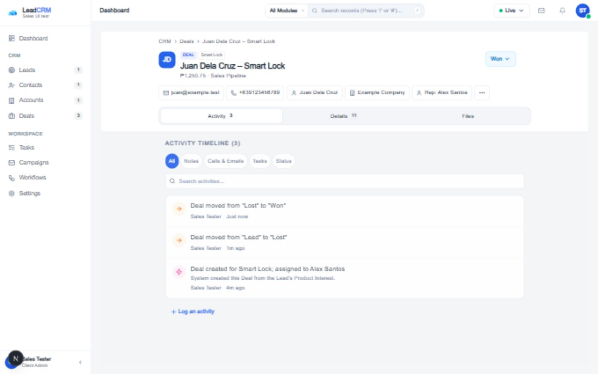
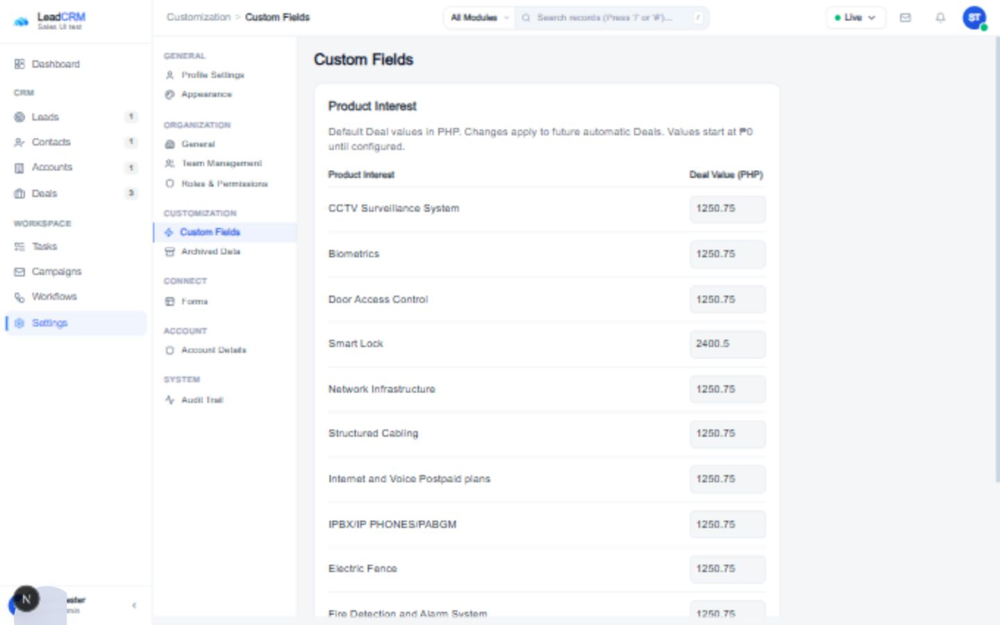

# Deals and sales automation implementation

## Outcome

Deals now presents one Sales Pipeline Kanban. New Leads are assigned on the backend before one Deal per selected Product Interest is created. Actual transitions into Won resolve Contact and Account associations in the same transaction while retaining the Lead, sibling Deals, ownership, activity, and stage history.

Changes are local and uncommitted. No deployment or live database migration was performed.

## UI and shared components

- Removed New Pipeline, pipeline selection, Sort, the menu beside My Deals, and all board/list/table view selectors. Existing backend pipeline models remain available to existing consumers.
- Reused `PipelineKanbanBoard`, `ForecastBar`, `ModuleFilterRail`, `FilterButton`, `RefreshButton`, and `CreateActionDropdown`.
- Search, All Deals/My Deals, and filters operate on real Deal records. Filters cover stage, assigned agent, Product Interest, priority, open/won/lost status, and last 7/30/90 days. Records are fetched through the existing paginated endpoint; all pages are loaded so filters and totals do not silently omit later pages.
- Reused `CrmRecordPanel` / `CrmRecordView` for Deal drawer and full page. These share the Leads header, information chips, stage control, Activity/Details/Files tabs, `RecordTimelineTab`, `RecordSection`, `RecordRows`, `RelatedTasks`, and association links.
- Lost requires a reason. Both drawer stage changes and Kanban drops use the persisted stage endpoint. Cache invalidation refreshes records, metrics, activity, and Contact/Account counts. Removed the redundant frontend-created stage activity; the backend transaction creates the authoritative entry.
- Files retains the shared existing empty state. This task adds no upload/storage subsystem.

## Product configuration and assignment

Product names and monetary defaults use the existing `TenantPreference` JSON model, keyed by tenant + `product-interests` + `values`. The canonical form Product Interest list seeds persisted defaults of PHP 0. Client Admin can change the amounts in Settings > Custom Fields. Product identities remain stable; there is no generic product catalog or rename/delete feature. Changing defaults affects future Deals only.

New manual Leads, imported Leads, and Leads created by public forms use `createAssignedLead`:

1. Begin a serializable Prisma transaction and create the Lead.
2. Resolve the explicitly selected eligible owner, or rotate through eligible agents.
3. Persist `Lead.assignedUserId` and assignment activity.
4. Resolve selected products and amounts from tenant configuration.
5. Reuse the tenant/environment Sales Pipeline and its actual Lead stage, creating these only if absent.
6. Create one Deal per distinct selected product, with both `assignedUserId` and `ownerId` inherited from the Lead. Preserve `leadId` and the `LeadDeal` junction.
7. Commit the entire operation or roll it back.

Automatic eligibility requires an ACTIVE same-tenant user, an unarchived same-tenant role, and effective view/edit permissions for Leads (`contacts`) and Deals (`deals`). Guest, System Admin, and Client Admin are excluded from rotation. An active Client Admin may still be explicitly assigned, consistent with existing ownership rules.

No default sales-owner configuration existed. Round-robin stores the last agent ID in `TenantPreference` under `lead-assignment`, keyed by environment, with stable ID ordering. Serializable conflicts and uniqueness races are retried. If no agent is eligible, the existing nullable Lead ownership model permits an unassigned Lead; automatic Deals are deferred until assignment is resolved through Lead update. No fake owner or browser-only state is used.

## Won conversion, history, and idempotency

- Only an actual stage change writes a `DealStageHistory` and `Activity`, with actor, timestamp, previous stage, and next stage. A repeated request for the current stage returns the existing result.
- Won conversion is in that same serializable transaction. Existing Lead Contact links take precedence; otherwise normalized email or normalized Philippine phone identity is matched within tenant/environment. Ambiguous or archived matches return a conflict and roll back the stage change.
- Existing account links take precedence; otherwise case-insensitive company names with normalized whitespace resolve an Account. A new Account is created only when needed. Manual Contact-only Deals and legacy singular Contact links are supported.
- Existing Contact fields and ownership are preserved. Newly created Contacts inherit the Deal/Lead agent. Lead conversion links and ContactDeal links are saved without deleting the Lead or changing sibling Deals. Account active products are extended.
- Stage movement never reassigns the Lead or Deal. Existing explicitly configured workflow reassignment rules remain supported.
- `Lead.creationKey` uniquely identifies a manual creation request or import row per tenant/environment. Frontend Lead creation sends a UUID request ID that survives request retries.
- `Deal.automationKey` identifies Lead + Product Interest per tenant/environment, independently of the title. Database uniqueness and transactional checks prevent repeat automatic Deals.
- `FormSubmission.requestKey` uniquely identifies a request within its form. Public form clients retain a request UUID across retries. Existing identity matching still handles repeated inquiries.

## APIs and persistence

Frontend calls use the existing API client and `/api/proxy` convention. Backend routes are under `/api/v1`:

| Route | Purpose |
| --- | --- |
| GET `/crm/pipelines` | Resolve existing Sales Pipeline and stages |
| GET/POST `/crm/deals` | Read board records and manually create Deals |
| GET/PUT `/crm/deals/:id` | Shared record view and supported edits |
| PATCH `/crm/deals/:id/stage` | Atomic stage/history/Won conversion |
| PATCH `/crm/deals/:id/archive` | Existing archive action |
| POST `/crm/leads`, PUT `/crm/leads/:id` | Lead assignment and product automation |
| POST `/crm/leads/imports` | Existing import flow with assignment |
| POST `/public/forms/:publicId/submissions` | Public form creation and retry handling |
| GET/PUT `/administration/product-interests` | New narrowly scoped product-default configuration |
| GET `/crm/activities?dealId=...` | Actual Deal activity |
| Existing `/operations/tasks` routes | Linked Deal tasks |
| Existing Contact/Account record routes | Association navigation |

GET product configuration requires authentication and a valid workspace. PUT also requires `settings.edit` and Client Admin. Existing tenant, environment, and route permission middleware remain in place. Operational writes use the existing Prisma environment scope.

Migration: `backend/prisma/migrations/20261012000000_sales_automation/migration.sql` adds three nullable deduplication keys and unique indexes to Lead, Deal, and FormSubmission. No new table is introduced. Existing rows remain valid. Apply this migration through the normal deployment process before running the new backend, and configure product values before relying on monetary forecasts.

Validation uses shared Zod contracts: bounded product names and lists, unique configured names, control-character rejection in configured names, finite nonnegative amounts within a bounded range, two decimal places for product defaults, trimmed/bounded Deal titles, and bounded Lost reasons. Referenced owners must exist, be active, eligible, and same-tenant. IDs follow existing repository ID conventions; stage membership is checked against the Deal's pipeline. Prisma queries are parameterized. React renders text without injecting HTML.

## Verification actually performed

- `npm run lint`: all three workspaces passed TypeScript checks.
- `npm run build`: backend and frontend production build passed. Windows required sandbox escalation for Next.js to inspect the user-directory link. Prisma generation also required stopping the disposable preview API to release its DLL lock.
- Focused frontend suites: **60 tests passed across six files** (record panel/full page, Deal form, Deal adapter properties, Forms UI, API cache invalidation, and Deal Account field). The final panel/form changes were rerun: **15/15 passed**. A parallel run timed out under simultaneous build load; sequential runs passed.
- `node scripts/test-sales-db.mjs src/modules/crm/leads/sales-automation.integration.test.ts src/modules/marketing/forms/forms.validation.test.ts`: **25 tests passed**. Includes assignment rotation, inactive/foreign/unauthorized owners, atomic rollback, multiple products and prices, retry/concurrent processing, deferred assignment, stable ownership, independent sibling Deals, Won deduplication, normalized identities, environment isolation, public submissions, settings RBAC, Lost validation, and cross-pipeline rejection. The runner applies the actual new migration to an isolated PostgreSQL-compatible database.
- The broader default runner also executes existing Forms database tests. An early run passed all 41 then-existing tests. Later runs failed at the preexisting intentional FormSubmission CHECK-constraint rollback test: the PGlite socket returned `UnexpectedMessage`, lost its connection, and subsequent tests failed or skipped. **The final broader Forms database suite is not claimed as passing.** It needs rerunning against PostgreSQL or a corrected test transport.
- Browser: authenticated against a disposable API and database, verified product filtering and metric updates; Lost reason and persisted history; Won Contact/Account creation and unchanged agent; shared full-page navigation, Details associations/tasks and Files state; Product Interest save and reopening with the saved value.
- Breakpoints actually inspected: **320 × 800, 375 × 812, 768 × 1024, and 1440 × 900**. Confirmed full-width mobile record panel, visible tabs/stage controls, scrollable mobile filter, inline tablet/desktop filter, and horizontal Kanban. Document width remained within the tested viewport. Viewport override was reset.
- Physical touch dragging was not tested on a device; the existing Kanban drag mechanism is retained. Stage persistence was tested through the record control and HTTP.
- `git diff --check`: passed.

## Remaining limits and rollout notes

- No live data was changed. Migration/deployment and real product pricing remain rollout steps.
- Unknown legacy Product Interest names must be mapped to approved configured names before automatic Deals can be generated from them; the backend returns an explicit validation error.
- API callers should reuse their request ID after an uncertain create response. A genuinely new manual request without a reused ID is a new business transaction.
- Tenant product configuration is shared between environments because it uses the existing tenant-level preference model. Assignment rotation and all operational records remain environment-scoped.
- Full-board client filtering loads every Sales Pipeline page. Large datasets would benefit from future server-filtered aggregates/pagination; that broader API work is outside this change.
- Existing currency display rounds board totals/cards to whole pesos; exact configured values persist and appear in record details.
- No generic file storage, product catalog, task redesign, or unrelated module redesign was added.
- Database tests use PGlite; multi-instance serialization under real PostgreSQL has not been load-tested.
- Existing Next.js workspace-root and unset production backend-URL warnings remain. Production must provide its normal API_URL configuration.

## Screenshots

The images show disposable test records and prices.

## Files changed

- `backend/prisma/migrations/20261012000000_sales_automation/migration.sql`
- `backend/prisma/schema.prisma`
- `backend/src/api/routes/administration.routes.ts`
- `backend/src/modules/administration/product-interests/product-interests.controller.ts`
- `backend/src/modules/automation/actions/action-dispatcher.ts`
- `backend/src/modules/crm/contacts/contacts.dto.ts`
- `backend/src/modules/crm/contacts/contacts.repository.ts`
- `backend/src/modules/crm/deals/deals.dto.ts`
- `backend/src/modules/crm/deals/deals.repository.ts`
- `backend/src/modules/crm/deals/deals.service.ts`
- `backend/src/modules/crm/deals/won-conversion.service.ts`
- `backend/src/modules/crm/lead-imports/lead-imports.service.ts`
- `backend/src/modules/crm/leads/lead-automation.service.ts`
- `backend/src/modules/crm/leads/sales-automation.integration.test.ts`
- `backend/src/modules/crm/leads/sales-automation.preview.ts`
- `backend/src/modules/crm/pipeline/pipeline.service.ts`
- `backend/src/modules/marketing/forms/public-forms.service.ts`
- `docs/sales-deal-preview.png`
- `docs/sales-product-settings-preview.png`
- `docs/SALES_AUTOMATION_IMPLEMENTATION.md`
- `frontend/src/features/tenant/crm/deals/ui/deal-detail-page.tsx`
- `frontend/src/features/tenant/crm/deals/ui/deal-form.test.tsx`
- `frontend/src/features/tenant/crm/deals/ui/deal-form.tsx`
- `frontend/src/features/tenant/crm/deals/ui/deals-page.tsx`
- `frontend/src/features/tenant/crm/leads/ui/lead-form.tsx`
- `frontend/src/features/tenant/crm/pipeline/ui/pipeline-page.tsx`
- `frontend/src/features/tenant/marketing/forms/ui/form-input.tsx`
- `frontend/src/features/tenant/marketing/forms/ui/forms.test.tsx`
- `frontend/src/features/tenant/marketing/forms/ui/public-form-page.tsx`
- `frontend/src/features/tenant/settings/ui/product-interests-settings.tsx`
- `frontend/src/features/tenant/settings/ui/settings-page.tsx`
- `frontend/src/lib/api/adapters/__tests__/deal-adapter-linkage.property.test.ts`
- `frontend/src/lib/api/adapters/contact.adapter.ts`
- `frontend/src/lib/api/adapters/deal.adapter.ts`
- `frontend/src/shared/cache/invalidate-api-page-cache.ts`
- `frontend/src/shared/components/crm/RecordPanelWrappers.tsx`
- `frontend/src/shared/components/crm/__tests__/deal-panel.test.tsx` (removed; replaced by shared panel migration coverage)
- `frontend/src/shared/components/crm/__tests__/panel-migrations.test.tsx`
- `frontend/src/shared/components/crm/crm-record-view.tsx`
- `frontend/src/shared/components/crm/inline-deal-form.tsx`
- `frontend/src/store/DataContext.tsx`
- `scripts/test-sales-db.mjs`
- `shared/src/contracts/forms.contract.ts`
- `shared/src/contracts/product-interests.contract.ts`
- `shared/src/index.ts`
