# Current relational map

Generated from declared Prisma foreign keys; polymorphic history references and provider identifiers are intentionally not drawn as FKs. Composite tenant relations are annotated in the schema. See [inventory](normalization-inventory.md) for all attributes and live-only drift.

```mermaid
erDiagram
    Tenant ||--o{ User : "tenant"
    Tenant ||--o{ RoleDefinition : "tenant"
    RoleDefinition ||--o{ RolePermission : "role"
    User ||--o{ UserRole : "user"
    RoleDefinition ||--o{ UserRole : "role"
    Tenant ||--o{ UserRole : "tenant"
    User ||--o{ Session : "user"
    Tenant ||--o{ Session : "tenant"
    Tenant ||--o{ TenantGroup : "tenant"
    TenantGroup ||--o{ TenantGroupMember : "group"
    User ||--o{ TenantGroupMember : "user"
    Tenant ||--o{ TenantGroupMember : "tenant"
    Tenant ||--o{ Account : "tenant"
    User |o--o{ Account : "assignedUser"
    Tenant ||--o{ Lead : "tenant"
    Account |o--o{ Lead : "account"
    User |o--o{ Lead : "assignedUser"
    User |o--o{ Lead : "createdBy"
    User |o--o{ Lead : "updatedBy"
    Contact |o--o{ Lead : "convertedContact"
    User |o--o{ Lead : "convertedBy"
    Tenant ||--o{ Contact : "tenant"
    Account |o--o{ Contact : "account"
    User |o--o{ Contact : "assignedUser"
    User |o--o{ Contact : "owner"
    Tenant ||--o{ Pipeline : "tenant"
    Pipeline ||--o{ Stage : "pipeline"
    Tenant ||--o{ Stage : "tenant"
    ProductInterest |o--o{ Deal : "productInterestRecord"
    Tenant ||--o{ Deal : "tenant"
    Pipeline ||--o{ Deal : "pipeline"
    Stage ||--o{ Deal : "stage"
    Account |o--o{ Deal : "organization"
    User |o--o{ Deal : "assignedUser"
    User |o--o{ Deal : "owner"
    Lead ||--o{ LeadDeal : "lead"
    Deal ||--o{ LeadDeal : "deal"
    Tenant ||--o{ LeadDeal : "tenant"
    User |o--o{ LeadDeal : "addedBy"
    Contact ||--o{ ContactDeal : "contact"
    Deal ||--o{ ContactDeal : "deal"
    Tenant ||--o{ ContactDeal : "tenant"
    User |o--o{ ContactDeal : "addedBy"
    Tenant ||--o{ DealStageHistory : "tenant"
    Deal ||--o{ DealStageHistory : "deal"
    User ||--o{ DealStageHistory : "movedBy"
    Stage ||--o{ DealStageHistory : "newStage"
    Stage |o--o{ DealStageHistory : "previousStage"
    Tenant ||--o{ Task : "tenant"
    User ||--o{ Task : "assignedUser"
    User |o--o{ Task : "assignedBy"
    User |o--o{ Task : "completedBy"
    Tenant ||--o{ Activity : "tenant"
    User ||--o{ Activity : "createdBy"
    Lead |o--o{ Activity : "lead"
    Contact |o--o{ Activity : "contact"
    Deal |o--o{ Activity : "deal"
    Account |o--o{ Activity : "organization"
    Task |o--o{ Activity : "task"
    Tenant ||--o{ Notification : "tenant"
    User ||--o{ Notification : "user"
    Tenant ||--o{ ClosingFieldDefinition : "tenant"
    Tenant ||--o{ TargetAudience : "tenant"
    TargetAudience ||--o{ TargetAudienceCondition : "targetAudience"
    Tenant ||--o{ Campaign : "tenant"
    TargetAudience |o--o{ Campaign : "targetAudience"
    Template |o--o{ Campaign : "emailTemplate"
    Template |o--o{ Campaign : "smsTemplate"
    Tenant ||--o{ MarketingForm : "tenant"
    User ||--o{ MarketingForm : "createdBy"
    MarketingForm ||--o{ FormSubmission : "form"
    Lead |o--o{ FormSubmission : "lead"
    Contact |o--o{ FormSubmission : "contact"
    Tenant ||--o{ CampaignMetrics : "tenant"
    Campaign ||--o{ CampaignMetrics : "campaign"
    Tenant ||--o{ CampaignContact : "tenant"
    Campaign ||--o{ CampaignContact : "campaign"
    Lead |o--o{ CampaignContact : "lead"
    Contact |o--o{ CampaignContact : "contact"
    Tenant ||--o{ Template : "tenant"
    Tenant ||--o{ Workflow : "tenant"
    Tenant ||--o{ WorkflowTriggerRecord : "tenant"
    Workflow ||--o{ WorkflowTriggerRecord : "workflow"
    Tenant ||--o{ WorkflowExecutionRun : "tenant"
    WorkflowTriggerRecord ||--o{ WorkflowExecutionRun : "trigger"
    Tenant ||--o{ WorkflowExecutionStep : "tenant"
    WorkflowExecutionRun ||--o{ WorkflowExecutionStep : "execution"
    Tenant ||--o{ AuditLog : "tenant"
    User ||--o{ AuditLog : "user"
    Tenant ||--o{ EmailDeliveryLog : "tenant"
    Campaign |o--o{ EmailDeliveryLog : "campaign"
    Lead |o--o{ EmailDeliveryLog : "lead"
    Contact |o--o{ EmailDeliveryLog : "contact"
    PasswordResetToken {
        string primary_key
    }
    MailboxOAuthState {
        string primary_key
    }
    EmailAccount ||--o{ MailboxMessage : "account"
    Tenant ||--o{ EmailEvent : "tenant"
    EmailDeliveryLog ||--o{ EmailEvent : "deliveryLog"
    Tenant ||--o{ UserPreference : "tenant"
    User ||--o{ UserPreference : "user"
    Tenant ||--o{ TenantPreference : "tenant"
    Tenant ||--o{ CrmImportJob : "tenant"
    User ||--o{ CrmImportJob : "createdBy"
    CrmImportUpload |o--o{ CrmImportJob : "upload"
    CrmImportJob ||--o{ CrmImportRowResult : "job"
    Tenant ||--o{ CrmImportUpload : "tenant"
    User ||--o{ CrmImportUpload : "actor"
    CrmImportUpload ||--o{ CrmImportChunk : "upload"
    CampaignEmailQuota {
        string primary_key
    }
    Task ||--o{ TaskLead : "task"
    Lead ||--o{ TaskLead : "lead"
    Task ||--o{ TaskContact : "task"
    Contact ||--o{ TaskContact : "contact"
    Task ||--o{ TaskDeal : "task"
    Deal ||--o{ TaskDeal : "deal"
    Task ||--o{ TaskAccount : "task"
    Account ||--o{ TaskAccount : "account"
    Deal |o--o{ RecordFile : "deal"
    Tenant ||--o{ RecordFile : "tenant"
    Lead |o--o{ RecordFile : "lead"
    Contact |o--o{ RecordFile : "contact"
    Account |o--o{ RecordFile : "account"
    User ||--o{ RecordFile : "uploadedBy"
    Tenant ||--o{ ProductInterest : "tenant"
    Lead ||--o{ LeadProductInterest : "lead"
    ProductInterest ||--o{ LeadProductInterest : "product"
    Contact ||--o{ ContactProductInterest : "contact"
    ProductInterest ||--o{ ContactProductInterest : "product"
    Account ||--o{ AccountProductInterest : "account"
    ProductInterest ||--o{ AccountProductInterest : "product"
    EmailAccount ||--o{ MailboxThreadAssociation : "account"
    Deal ||--o{ MailboxThreadAssociation : "deal"
```

