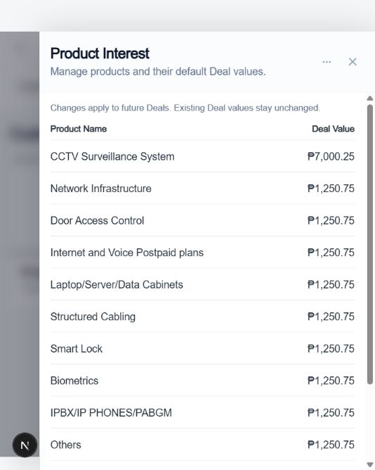
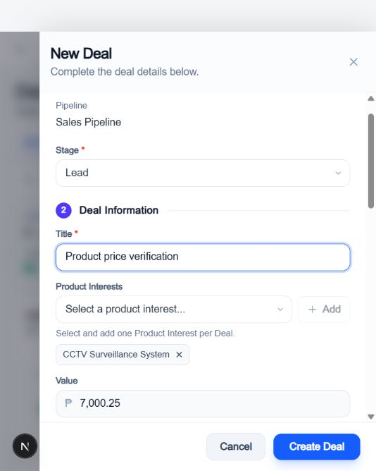

# Product Interest and CRM cleanup verification

Date: 2026-09-30. Changes are local; no production deployment or production data mutation was performed.

## Product Interest save trace and root-cause limits

The existing flow is ProductEditor form state -> shared ProductInterestSchema -> apiClient.patch -> Next.js proxy -> administration route (auth, tenant and settings.edit permission) -> controller validation -> salesTransaction -> tenant-scoped Prisma ProductInterest.update -> committed response -> shared useProductInterests catalog.

The existing endpoint is **PATCH /api/v1/administration/product-interests/:id**. The frontend calls `/administration/product-interests/:id` through `/api/proxy/administration/product-interests/:id`, sending the selected product UUID plus `{ name, dealValue }`. No duplicate endpoint was introduced.

The previous implementation already wrote through Prisma. The reported production database failure could not be reproduced in the isolated database. **The exact cause of the reported production non-persistence: I cannot confirm this.** Confirmed weaknesses were that the UI discarded the mutation response, closed the editor and depended on a later refetch, and the controller performed a separate catalog read after its write transaction. The response now includes the catalog read inside the write transaction and is sent after commit. The hook installs that server response, aborts older reads that could overwrite it, and refetches. This makes committed server state visible immediately without frontend-only persistence.

Validation retains valid UUIDs, trimmed product names, uniqueness within the tenant, active-record checks, and non-negative numeric prices with at most two decimal places. Formatted currency strings are not database input. Sonner `toast.success('Product updated successfully.')` runs only after the successful response. Failures use `toast.error`, retain editor values, and do not announce success. A synchronous ref guard and disabled/loading controls prevent duplicate submissions.

## Database evidence and schema

- No schema or migration changes. ProductInterest.dealValue remains the existing Decimal column.
- Executed authenticated HTTP integration tests against disposable PGlite PostgreSQL-compatible SQL using the real Prisma client. After PATCH from 5000 to 7000.25, an independent Prisma findUnique read asserted the decimal column and trimmed name. A fresh GET returned 7000.25.
- A Deal created before the price edit remained 5000. A later manual Deal used 7000.25 even when its submitted amount was 1 and currency was USD. The backend stored PHP and the database product name. An attempt to overwrite a linked Deal price was rejected.
- The local browser saved CCTV Surveillance System from 1250.75 to 7000.25, showed the success toast, reloaded, and still displayed 7000.25. New Deal displayed the same read-only price and creation produced a new Deal in the pipeline. See the attached verification screenshots.
- A separate command-line read of the browser preview database could not establish a second connection. Direct row verification is from the executed integration test above, not that failed command.
- Production Supabase row state and the originally reported deployment failure: **I cannot confirm this.** No production database access was used.
- Account database cleanup is now covered by the forward cleanup migration; the obsolete fields and their conversion dependencies have been removed. No archived records were deleted.

## Behavior delivered

- Custom Fields owns one title/action row, with a labelled compact action on narrow screens. Initial/no-data fetches use the existing animated skeleton pattern matching the card. Loaded content is retained during refresh.
- Shared `LeadsPagination` removes only the footer total label and retains page size, page number, navigation and refresh indication. Accounts and Contacts now reuse it instead of copied footer markup. Its callers are Leads, Contacts, Accounts, Tasks, Workflows, Campaigns, Archived Data and Team Management. `PaginationControls` also removes the redundant total segment for ModuleWorkspace. Table totals remain intact. The browser confirmed one table total and no duplicate footer total in Accounts.
- Accounts no longer expose Account/Customer Type, Customer Since, Customer Classification, or Tax ID in forms, details, table/column choices, imports, filters or creation/update contracts. Sections are Basic Information (1), Address (2), Relationships (3), Products & Interests (4), Notes (5). The browser successfully created Verification Account with just its name; API/database tests also cover creation without retired fields.
- Archived Data offers All, Lead, Contact, Account, Deal and User. Pipeline, Role, Workflow, Campaign and Template are excluded from the shared query contract and therefore from All before pagination/counting. Legacy restoration routes and underlying rows remain. Tests verify rejected excluded filters and retained database rows.
- Per the user's explicit choice, each manual New Deal selects exactly one Product Interest. The existing select/add/remove interaction sits directly below Title. Value is read-only with peso formatting. The server resolves an active tenant-owned product inside the creation transaction, writes its name and price snapshot, and ignores arbitrary submitted amounts. Missing, invalid, foreign-tenant and inactive IDs are rejected. Related-record inline Deal creation follows the same contract. Trusted historical imports retain their existing contract; automatic lead Deal generation remains one per product.

## Executed checks

- `npm run lint`: passed in all three workspaces (TypeScript checks).
- `node scripts/test-sales-db.mjs src/modules/crm/leads/sales-automation.integration.test.ts src/modules/crm/companies/companies-validation.test.ts`: 25 tests passed in two suites.
- Frontend Vitest focused run: 54 tests passed in eight suites: Product Interest settings, Archived Data, Team Management, Deal form, Account validation, task-related record creation, CRM panel components, and RecordPanel. Tests include pending save/no premature toast, failed save retention, skeleton, product selection/removal, historical values and retired fields.
- `npm --prefix frontend run build`: passed, including production compilation, type validation and 189 generated pages. It required an approved outside-sandbox retry because Next.js selected a parent workspace root. Existing warnings reported multiple lockfiles and an unset production API_URL in the local build environment; deployment configuration was not changed.
- Backend `node ../node_modules/typescript/bin/tsc`: passed from backend.
- `npm run build`: attempted but blocked by Windows EPERM while Prisma tried to replace its loaded query-engine DLL. **Full monorepo build: I cannot confirm this.** The individual frontend build and backend compilation above succeeded.
- `git diff --check`: passed (line-ending warnings only).
- Browser verification used the real local API with disposable fixtures. Product save/refresh/toast, New Deal selection/read-only value/creation, Account fields/create/table/footer and responsive layouts were inspected. The temporary preview had intermittent database connection errors and was restarted after a production build affected dev artifacts; successful checks were repeated after recovery.

## Screenshots

## Files changed

The complete file inventory follows below.

- `backend/src/api/routes/crm.routes.ts`
- `backend/src/modules/administration/archived-data/archived-data.service.ts`
- `backend/src/modules/administration/product-interests/product-interests.controller.ts`
- `backend/src/modules/crm/companies/companies-validation.test.ts`
- `backend/src/modules/crm/companies/companies.dto.ts`
- `backend/src/modules/crm/companies/companies.repository.ts`
- `backend/src/modules/crm/companies/companies.service.ts`
- `backend/src/modules/crm/companies/companies.types.ts`
- `backend/src/modules/crm/deals/deals.dto.ts`
- `backend/src/modules/crm/deals/deals.repository.ts`
- `backend/src/modules/crm/deals/deals.service.ts`
- `backend/src/modules/crm/leads/sales-automation.integration.test.ts`
- `backend/src/modules/crm/merge/merge.service.ts`
- `backend/src/modules/preferences/column-registry.ts`
- `docs/API.md`
- `frontend/src/features/tenant/crm/accounts/accounts.config.ts`
- `frontend/src/features/tenant/crm/accounts/config/record-detail.config.tsx`
- `frontend/src/features/tenant/crm/accounts/schemas/account.schema.ts`
- `frontend/src/features/tenant/crm/accounts/types/account.types.ts`
- `frontend/src/features/tenant/crm/accounts/ui/__tests__/account-validation.test.tsx`
- `frontend/src/features/tenant/crm/accounts/ui/account-form.tsx`
- `frontend/src/features/tenant/crm/accounts/ui/accounts-data-grid.tsx`
- `frontend/src/features/tenant/crm/accounts/ui/accounts-page.tsx`
- `frontend/src/features/tenant/crm/contacts/ui/contacts-page.tsx`
- `frontend/src/features/tenant/crm/deals/ui/deal-form.test.tsx`
- `frontend/src/features/tenant/crm/deals/ui/deal-form.tsx`
- `frontend/src/features/tenant/crm/leads/ui/company-profile-tabs.tsx`
- `frontend/src/features/tenant/crm/shared/import/configs/account-import.config.ts`
- `frontend/src/features/tenant/operations/tasks/__tests__/task-related-record-creator.test.tsx`
- `frontend/src/features/tenant/operations/tasks/ui/task-record-creator.tsx`
- `frontend/src/features/tenant/operations/tasks/ui/task-related-record-creator.tsx`
- `frontend/src/features/tenant/settings/services/archived-data.service.ts`
- `frontend/src/features/tenant/settings/ui/__tests__/archived-data.test.tsx`
- `frontend/src/features/tenant/settings/ui/__tests__/team-management-users.test.tsx`
- `frontend/src/features/tenant/settings/ui/archived-data.tsx`
- `frontend/src/features/tenant/settings/ui/product-interests-settings.test.tsx`
- `frontend/src/features/tenant/settings/ui/product-interests-settings.tsx`
- `frontend/src/features/tenant/settings/ui/settings-page.tsx`
- `frontend/src/lib/api/adapters/deal.adapter.ts`
- `frontend/src/lib/api/adapters/organization.adapter.ts`
- `frontend/src/shared/components/crm/RecordPanel.test.tsx`
- `frontend/src/shared/components/crm/__tests__/panel-components.test.tsx`
- `frontend/src/shared/components/crm/crm-record-view.tsx`
- `frontend/src/shared/components/crm/inline-deal-form.tsx`
- `frontend/src/shared/components/crm/leads-pagination.tsx`
- `frontend/src/shared/components/crm/moduleConfig.ts`
- `frontend/src/shared/components/crm/pagination-controls.tsx`
- `frontend/src/shared/components/data-grid/cell-renderers.tsx`
- `frontend/src/shared/components/data-grid/index.ts`
- `frontend/src/shared/constants/column-registries.ts`
- `frontend/src/shared/hooks/use-product-interests.ts`
- `frontend/src/shared/services/companies.api.ts`
- `frontend/src/store/DataContext.tsx`
- `shared/src/contracts/archived-data.contract.ts`
- `shared/src/types/company.types.ts`
- `shared/src/types/deal.types.ts`
- `docs/product-interest-account-cleanup-verification.md`
- `docs/verification/product-price-after-refresh.png`
- `docs/verification/new-deal-product-price.png`
