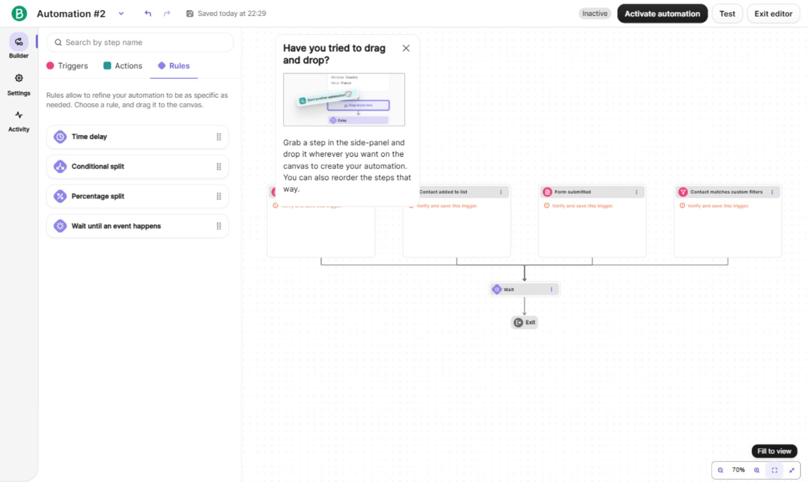
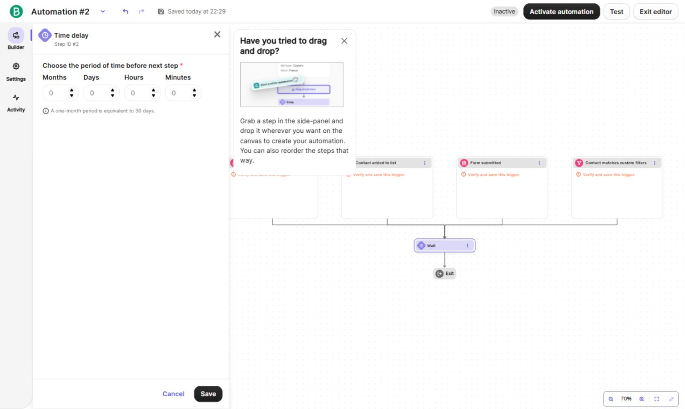
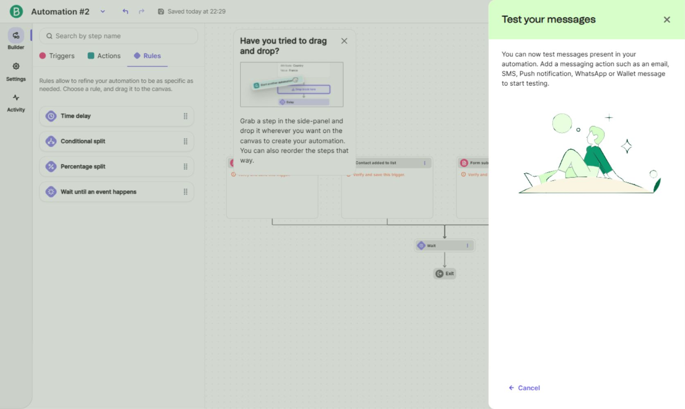
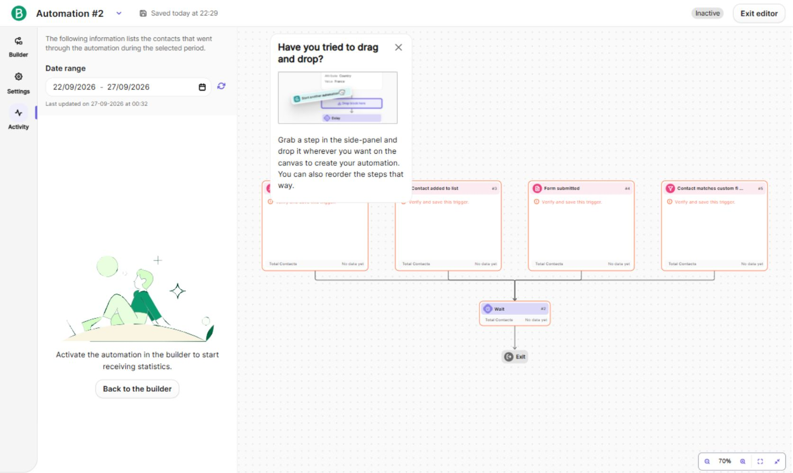
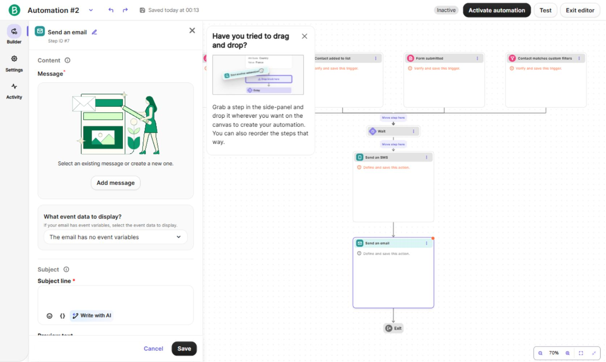
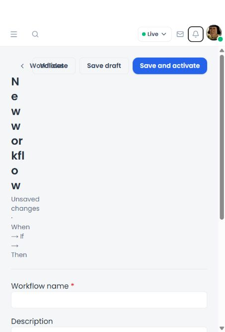
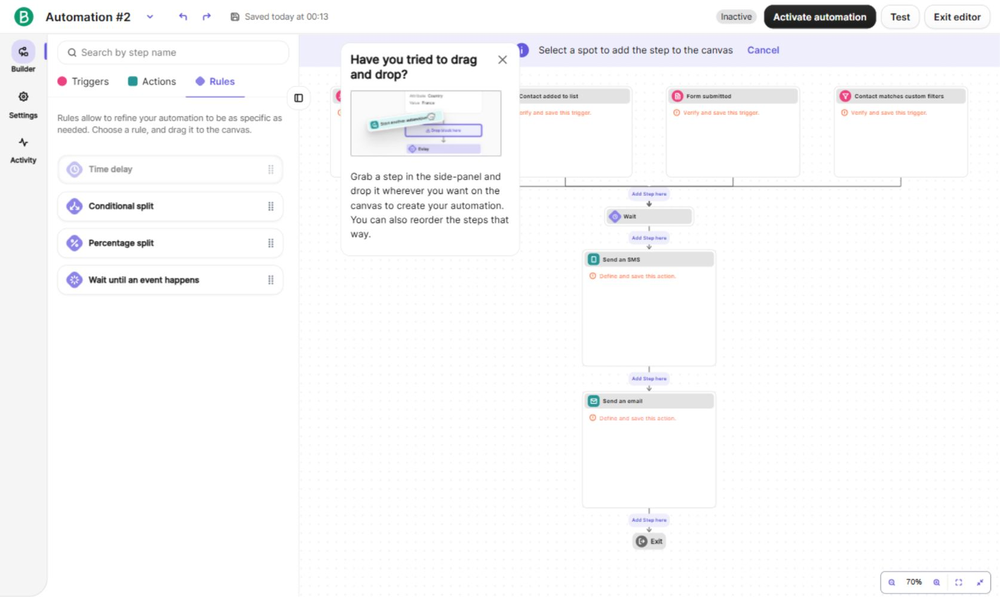

# Workflow visual builder: Brevo reference audit and proposed scope

Date: 2026-09-27. Status: **audit complete; implementation awaiting scope approval**.

Upgrade the existing LeadCRM builder into a connected, drag-and-drop CRM automation editor. Keep the current workflow routes, canonical definition, APIs, permissions, domain services, and server execution. The reference is interaction design, not Brevo code, assets, or a pixel copy.

## Evidence and limits

Inspected the user's authenticated [Brevo editor](https://app.brevo.com/automation/edit/2), the three supplied screenshots, the deployed LeadCRM new-workflow screen, and the current repository. Browser inspection stayed within automation and its configuration, settings, and activity views. No activation, message test, step placement, deletion, or configuration Save was submitted in Brevo. No LeadCRM workflow was saved or activated.

Directly exercised library tabs and search, click-to-place preview/cancellation, selecting existing steps, configuration cancellation, the step menu, Escape dismissal, zoom, fit, compact presentation, Test entry, Settings, and Activity. Actual drag/drop persistence, duplicate/delete completion, activation errors, pause/deactivation execution, live delivery, populated activity, full screen-reader behavior, and touch hardware behavior were not exercised. Those are not claimed as verified.

Brevo's documented drop highlighting, first-row trigger constraint, action-only deactivation, and pause/inactive semantics supplement the live inspection; see its [editor overview](https://help.brevo.com/hc/en-us/articles/15445936637330-Overview-of-the-new-automation-editor). In particular, Brevo's paused state allows existing contacts to progress, whereas inactive removes them. LeadCRM must retain its own engine's pause behavior.

The captured draft showed different action sets after switching between Activity, Settings, and Builder. Captures describe the visible state at each observation; they are not evidence of a save or a successful execution. Later Builder captures include the supplied-reference SMS and email cards.

## Observed flow

| Step | Observation | Health and implication |
| --- | --- | --- |
| 1. Find a building block | Search above Triggers / Actions / Rules; collapsible domain groups; colored category icons and drag grips. | Clear grouping reduces scanning. Adopt a smaller library generated from LeadCRM metadata. |
| 2. Search | Searching `email` showed grouped matches from both triggers and actions. Clearing the query left a search state with a back control. | Useful cross-category discovery; LeadCRM should also make clearing/exiting search obvious. |
| 3. Choose placement | Clicking Time delay revealed `Add Step here` buttons on connections and a placement instruction with Cancel. Selecting an existing email step also exposed move targets. | Strong non-drag alternative and visible topology. LeadCRM should expose only positions its engine can execute. |
| 4. Configure | Selecting a trigger, delay, or email replaced the left library with configuration. The selected card gained a purple outline; the canvas stayed visible. Save/Cancel remained at the bottom. | Good context retention. LeadCRM will use a desktop inspector and mobile sheet, with live summaries and explicit workflow saving. |
| 5. Manage a step | The existing Wait card's menu offered Duplicate and Delete; Escape dismissed the menu. | Keep secondary actions in a menu. In LeadCRM, duplicate actions only; preserve one trigger and one condition group. |
| 6. Navigate | Fit brought offscreen triggers into view; zoom changed 70% to 84%; compact mode reduced cards to headers. | Adopt zoom, fit, center/reset, and compact mode. Preserve error indicators and useful summaries in compact mode. |
| 7. Test | Test opened a message-testing panel. With no messaging actions visible in that state, it explained what was needed. | Clear empty feedback. LeadCRM Test will use its existing record-based, side-effect-free dry run, with explicit limits. |
| 8. Settings | Re-entry, exit, and restart conditions were shown separately from building blocks. | These need runtime behavior absent in LeadCRM; omit from this release. |
| 9. Activity | Date range, last-update information, per-node contact totals, and a no-data prompt were visible. | Adopt in-editor access to real run history; do not invent Brevo-style contact statistics. |
| 10. Narrow-screen use | Brevo's library occupied almost the entire narrow browser surface; the canvas/header were clipped. LeadCRM's current header squeezed the title into a near single-character column. | Adapt rather than copy. Use a wrapping toolbar, canvas-first mobile layout, and sheets for library/configuration. |

Accessibility observations are limited: several Brevo icon buttons were exposed simply as `button`, and the delay form exposed all four duration inputs as `Months` in its accessibility tree. Library items appeared as headings, while canvas nodes and insertion targets appeared as buttons. These are reasons to verify labels and keyboard building explicitly in LeadCRM, not a full compliance verdict.

## Comparison and adoption decisions

| Brevo pattern | LeadCRM current state | Adopt? | LeadCRM implementation |
| --- | --- | --- | --- |
| Connected drag/drop canvas | Centered WHEN / IF / THEN cards and arrow icons; no drag/drop in this builder. | Yes | One ordered canvas with typed drop zones, drag preview, and automatic connections. |
| Persistent builder library | Add Step opens a drawer and appends an action. | Yes | Searchable left library; Triggers, Conditions, Actions tabs; entity-compatible items. |
| Search across steps | Action labels searched inside Add Step. | Yes | Search available names/descriptions and metadata-backed condition fields, with grouped results and an empty state. |
| Step inspector | Existing modal side drawer with Save step. | Yes, refine | Reuse form controls; live local-draft summaries, selection outline, field errors, responsive inspector. |
| Insert between steps | Actions append at the end. | Yes | Add buttons and drop targets at every action boundary; both invoke the same editor operation. |
| Reorder/move | Move up/down buttons only. | Yes | Drag actions or use keyboard/menu move controls; trigger and condition gate remain in canonical positions. |
| Duplicate/delete step | Remove action exists; no action duplication. | Yes | Duplicate immediately after original; remove with recoverable local undo; stable editor identities. |
| Type distinction | All node labels use primary color. | Yes | Existing theme tokens plus icon, category label, restrained accents, and non-color status cues. |
| Zoom / fit / compact | No canvas controls. | Yes | Bounded zoom, scroll/pan navigation, measured fit, reset/center, compact readable cards. |
| Inline incomplete states | Generic errors after validation; sparse node summaries. | Yes | Needs setup / ready indicators; actionable field errors and a validation summary that selects affected steps. |
| Draft/active status and save feedback | Status shown in list; editor loses persisted PAUSED status, closes after saving. | Yes, adapt | Persisted Draft / Active / Paused badge plus separate unsaved indicator; save in place on existing routes. |
| Activation / pause | Existing validated APIs; pause control in list. | Yes, reuse | Explicit header actions; retain backend authority, action permissions, and current pause semantics. |
| Test | API client and backend dry-run endpoint exist; no current frontend call site. | Yes | Sample record picker using actual CRM names; test saved definition and explain unsaved changes. |
| Activity in editor | Real paginated Runs modal from list. | Yes | Reuse run content in an editor Activity view and the existing list modal. |
| Conditions / rules | Metadata-backed fields and one flat AND/OR group. | Yes, preserve | One ALL/ANY gate before actions; human-readable rule/value summaries; unmatched records stop. |
| Multiple triggers | One trigger string in the contract. | No | One trigger at start. Replacing entity type previews affected steps; never silently deletes them. |
| YES/NO, percentage splits, loops | No branch edges or branch evaluator. | Future | Would require a deliberate canonical contract/engine change; no frontend-only branches. |
| Delays / event waits | No durable workflow scheduling or suspended-run continuation. | Future | Omit. Task due dates remain supported and do not imply delayed action execution. |
| Disable individual action | No enabled/disabled property in canonical actions. | Future | Show incomplete steps and unavailable operations honestly; do not pretend an action is skipped at runtime. |
| Re-entry / exit / restart settings | Event-based engine, deduplication and recursion guards. | Future | Keep current behavior; no settings unsupported by the engine. |
| Brevo autosave | Explicit API saves; a saved active definition is authoritative immediately. | No for this release | Update the local draft instantly; explicit Save/Activate/Pause with clear status and unsaved-navigation protection. |

## What the repository supports

The source audit confirms eight registered domain events: Lead created/status changed; Client Profile created/status changed; Deal created/stage changed/closed won/closed lost. The CRM services invoke their matching emitters. Conditions come from the trigger's actual field metadata, not a hardcoded menu of example rules.

Seven action types exist: Create task, Send email, Send notification, Assign owner, Update safe field, Move deal stage, and Send campaign. Send email supports Leads/Client Profiles; Move deal stage supports Deals; the library must honor these compatibility lists. There is no SMS workflow action.

Important behavior to keep visible in the UI:

- Task/notification assignee can default to the record owner. Task due date defaults to three days when omitted; the example's Tomorrow is explicitly one day.
- Existing message variables are `{{first_name}}`, `{{last_name}}`, `{{email}}`, and `{{company}}`. The example `{{lead.firstName}}` is unsupported; provide readable insertion choices for the existing variables.
- Send email uses an actual connected Gmail sender and template or subject/message. Sandbox blocks external email. The options endpoint currently supplies users, not verified sender connection status; activation validation remains authoritative unless that existing options response is extended.
- Send campaign sends the selected draft to its saved audience once. It is not a personalized per-trigger send. Preserve this explanation and campaign service protections.
- Safe updates are Lead/Deal description or Client Profile notes. Protected status/identity fields remain unavailable.
- Pipeline selection can narrow the existing named stage options; only `stageId` is serialized. Stage-specific entry requirements and lost reasons remain enforced by the governed Deal service.
- Drafts can contain incomplete actions, but the backend still validates supplied values/references and condition rules. Do not silently strip incomplete rules to make Save succeed; point to the fields needing correction.

The canonical definition has one trigger, one optional ALL/ANY condition group, and at most 20 sequential actions (30 condition rules). The engine evaluates the group before actions; false conditions skip the actions. Conditions cannot be inserted after an action without changing runtime semantics.

Execution is backend-owned and independent of the editor being open. It is currently immediate in-process execution, not a durable scheduler: browser closure is not an execution dependency, but server crash recovery and scheduled waits are separate future work. Pausing, archiving, or updating the saved workflow causes remaining actions to be skipped when the engine next checks; an already dispatched action cannot be recalled.

Runs store step index/type/outcome, not stable action IDs or full saved-definition revisions. Keep historical run outcomes in their own ordered view. Do not overlay an old run onto newly reordered canvas nodes and imply an exact match.

Source map:

- [Existing builder](../../frontend/src/features/tenant/automation/workflows/ui/visual-workflow-builder.tsx), [page integration](../../frontend/src/features/tenant/automation/workflows/ui/workflow-builder-page.tsx), [forms](../../frontend/src/features/tenant/automation/workflows/ui/workflow-fields.tsx), [Runs](../../frontend/src/features/tenant/automation/workflows/ui/workflow-execution-log-modal.tsx).
- [Canonical contract](../../shared/src/contracts/workflow.contracts.ts), [catalog](../../shared/src/contracts/workflow-catalog.ts), [API client](../../frontend/src/shared/services/workflows.api.ts).
- [Routes and permissions](../../backend/src/api/routes/automation.routes.ts), [workflow service](../../backend/src/modules/automation/workflows/workflows.service.ts), [engine](../../backend/src/modules/automation/workflows/workflow.engine.ts), [action validation](../../backend/src/modules/automation/actions/action-validation.ts), [domain action dispatch](../../backend/src/modules/automation/actions/action-dispatcher.ts).
- Existing [production report](workflow-production-report.md), [architecture](../ARCHITECTURE.md), [structure](../STRUCTURE.md), and [API](../API.md) remain the supporting documentation.

## Implementation plan

1. **Refactor the existing editor state.** Keep `/automation/workflows`, `/automation/workflows/new`, and `/automation/workflows/[id]/edit`. Use a single draft and a small set of add/insert/move/duplicate/remove/update operations shared by drag, click, and keyboard. Give steps stable editor-only identities; strip identities and view state before serialization. Preserve existing compatible definitions, order, conditions, and reference IDs. Legacy unsupported definitions require explicit repair without losing history.

2. **Build the editor workspace.** Replace the internals of `visual-workflow-builder.tsx` with a header, left library, connected central canvas, and selected-step inspector. Reuse LeadCRM Button/Input/Tooltip/Dialog, icons, typography, colors, focus styles, and dark tokens. Display a start trigger, optional condition gate, ordered actions, and an End marker. The false condition outcome is explanatory text, not a fake executable branch. Put insert controls on the connections; keep the workflow readable without opening forms.

3. **Use the installed drag/drop stack.** Reuse `@dnd-kit/core`, `@dnd-kit/sortable`, and `@dnd-kit/utilities` already used in Forms, Tasks, and Pipeline. One DndContext spans the library and canvas. Use its sensors and DragOverlay rather than native HTML dragging or a new hand-built drag engine. Trigger accepts only the start slot; conditions only the pre-action gate; actions only valid ordered action slots. Invalid drops and cancelled drags preserve the draft. Check zoomed/scrolling hit targets explicitly. Add no graph/canvas dependency for this bounded sequence.

4. **Improve configuration and validation.** Reuse metadata-backed fields and scoped options; show resolved names, owners, target stages, due dates, condition values, and message/template summaries. Local changes immediately update cards. Add required-value guidance, supported variable insertion, empty-reference feedback, and validation navigation. Preview incompatible entity changes before applying them. Share pure validation metadata/helpers when useful instead of inventing an independent execution model. Keep authoritative reference, permission, provider, and Deal-transition checks on the server.

5. **Connect the complete editor lifecycle.** Keep one DataContext/API mutation owner. Return the saved workflow from existing create/update helpers so a first save can replace the URL with the existing edit route and subsequent saves stay in place. Show real persisted status separately from dirty state. Active workflows require explicit Save and activate or Save and pause semantics; no silent autosave into an executing definition. Reuse Pause. Surface the existing dry-run endpoint with an entity-compatible sample record picker; require saving changes before testing that saved definition. Reuse Runs inside Activity with loading/error/retry/empty states. New unsaved workflows explain why Test/Activity are not yet available.

6. **Finish usability and verify end to end.** Add undo/redo for local edits, protected exits, reliable focus restoration, named controls, status announcements, keyboard insertion/reordering, and reduced-motion behavior. Use a wrapping mobile toolbar with library/configuration sheets and a scrollable ordered canvas. Verify desktop, tablet, narrow mobile, browser zoom, dark/light mode, and a 20-action workflow. Include zoom, fit, center/reset, and compact cards only as working navigation features.

The installed dnd-kit version's [keyboard sensor documentation](https://dndkit.com/legacy/api-documentation/sensors/keyboard/) and [DragOverlay guidance](https://dndkit.com/legacy/api-documentation/draggable/drag-overlay/) support this approach. Use the documentation for the installed `@dnd-kit/core` API; no framework migration is needed.

Expected scope is primarily the existing frontend feature and its tests, with small changes to the existing data helpers. If better validation paths or sender/stage capability details require response metadata, extend the existing shared contract and endpoint in all three packages together. No new workflow API, database graph schema, execution service, runtime, route, or migration is planned.

## Acceptance and verification

- Build Warm Lead Follow-Up using drag and again using click/keyboard; both serialize to the same canonical definition. Include a task with `{{first_name}}`, owner assignment and one-day due date, owner notification, and a configured email.
- Build the Deal example using real pipeline/stage names and numeric conditions. Confirm the resulting action still reaches `moveDealStage` and its required-field/lost-reason checks.
- Insert at beginning/middle/end; reorder and duplicate actions; cancel drag; reject wrong entity/trigger/condition positions; preserve selected step during reordering; respect action/rule limits; undo removal without losing config.
- Check live summaries, invalid/missing references, ALL/ANY values, entity-change impact, incomplete draft behavior, read-only controls, and failed saves retaining edits.
- Save/reload/reopen without changing valid existing definitions; first save must not create duplicates on subsequent saves; preserve paused status and explain active editing effects.
- Confirm Test is a real read-only backend request against the saved workflow and selected record; stale/unsaved edits must never be represented as tested. No live messages from tests.
- Verify actual linked tasks, notifications, stage history and persisted runs with the existing guarded disposable-database integration suite. Provider transports remain mocked in automated tests; real delivery is not inferred from that result.
- Use mock fixtures for UI work, then a local backend/disposable database for integration. Keep fake visual data out of production services.
- Run the focused frontend workflow tests, backend automation tests, `npm run lint`, and `npm run build`. Perform browser checks for pointer and keyboard interaction at multiple zoom levels, scroll boundaries, 320/375/768/1440px layouts, and dark/light themes. Report unavailable checks explicitly.

No application code or dependency changes were made during this audit. No tests were run because this deliverable contains only research, screenshots, and a proposed plan. Earlier release-report test counts are historical, not results from this audit.

## Screenshot evidence

Screenshots are reference evidence only and must not be reused as product assets. The relevant captured views are below; full descriptions and limits are in the numbered flow table.

### 1. Library and connected canvas

### 2. Selected rule and configuration panel

### 3. Test entry feedback

### 4. Activity empty state

### 5. Selected email and move targets

### 6. LeadCRM narrow-screen header issue

### 7. Click-to-place targets

## Approval boundary

The user's request explicitly sequences the Brevo comparison and implementation plan before proceeding with approved scope. The proposed scope is the six steps above, including the connected canvas, real lifecycle controls, and focused verification. Branching, delays, SMS, multiple triggers, per-action disabling, new runtime behavior, and production deployment are excluded. Implementation begins after this scope is approved.
